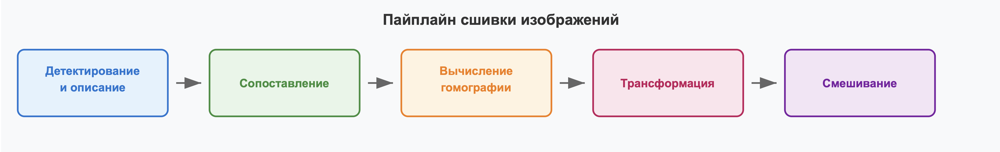
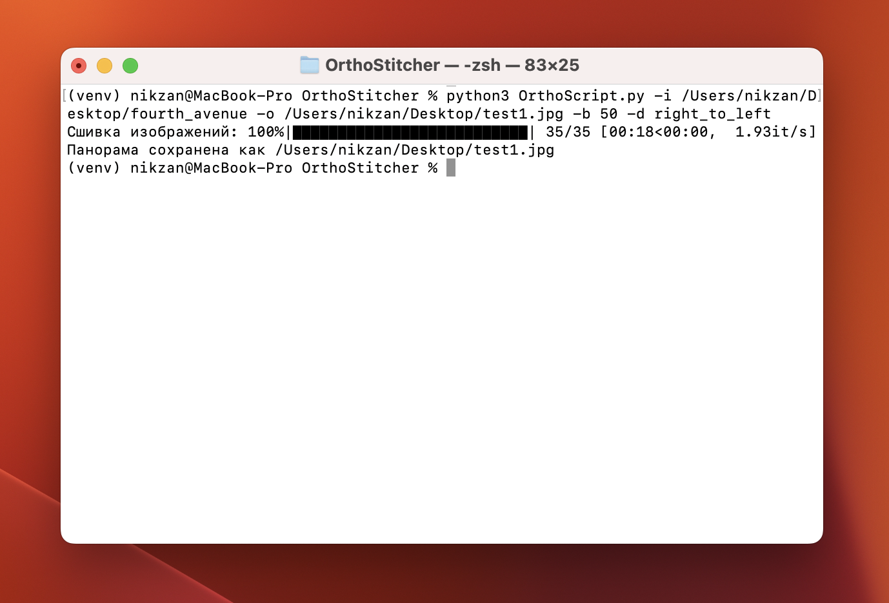
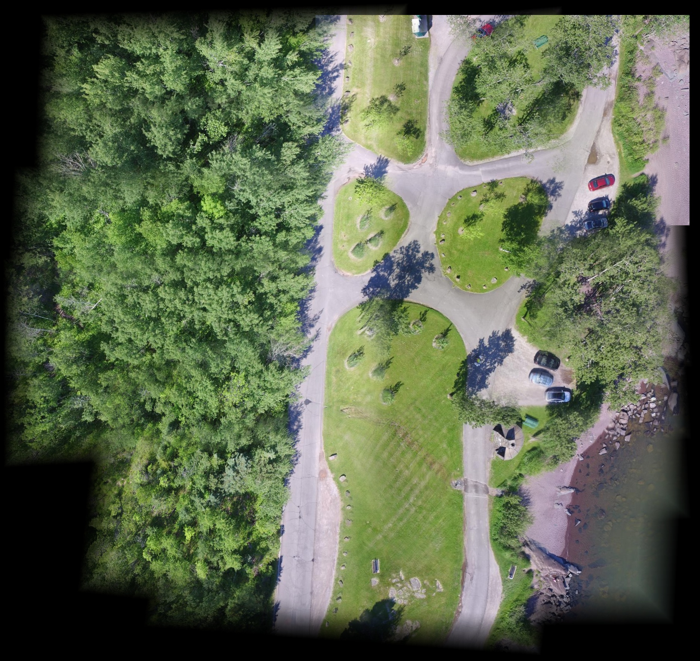

# OrthoStitcher

[](https://www.python.org/)
[](https://opencv.org/)
[](https://opensource.org/licenses/MIT)
[](https://github.com/nikzan/OrthoStitcher/stargazers)

**Программное средство построения ортофотоплана на основе компьютерного зрения**

OrthoStitcher - это консольное (CLI) приложение, разработанное для автоматизированной сшивки набора разрозненных цифровых изображений (например, аэрофотоснимков с БПЛА) в единый бесшовный ортофотоплан. Проект нацелен на предоставление быстрого, точного и доступного инструмента для создания крупномасштабных карт местности.

---

### **Содержание**

1.  [Проблема и Актуальность](#1-проблема-и-актуальность)
2.  [Ключевые Особенности](#2-ключевые-особенности)
3.  [Как это работает? (Архитектура)](#3-как-это-работает-архитектура)
4.  [Выбор алгоритмов](#4-выбор-алгоритмов)
5.  [Установка](#5-установка)
6.  [Использование](#6-использование)
7.  [Примеры результатов](#7-примеры-результатов)
8.  [Документация](#8-документация)
9.  [Перспективы развития](#9-перспективы-развития)
10. [Вклад в проект](#10-вклад-в-проект)
11. [Лицензия](#11-лицензия)
12. [Контакты](#12-контакты)

---

### **1. Проблема и Актуальность**

В современном мире активно используются беспилотные летательные аппараты (БПЛА) для получения аэрофотоснимков, что генерирует огромные объемы разрозненных данных. Для их эффективного использования в картографии, геодезии, мониторинге и кадастре требуется создание единых, бесшовных, крупномасштабных изображений — ортофотопланов.

**Традиционные методы:** Ручная или полуавтоматическая сшивка таких снимков является дорогостоящим, трудоемким и подверженным субъективным ошибкам процессом.
**Наше решение:** OrthoStitcher автоматизирует этот процесс, предоставляя точный и быстрый инструмент для создания бесшовных карт местности, который не требует никаких дополнительных метаданных, кроме самих изображений.


### **2. Ключевые Особенности**

*   **Полная автоматизация:** От загрузки изображений до готового ортофотоплана без ручного вмешательства.
*   **Независимость от метаданных:** Программа работает исключительно на основе визуального анализа изображений, не требуя GPS-координат, данных IMU или параметров камеры.
*   **Высокое качество сшивки:** Применяет градиентное смешивание для минимизации видимых швов и цветовых перепадов между снимками.
*   **CPU-оптимизация:** Эффективно работает на стандартных центральных процессорах, делая решение доступным для широкого круга пользователей без необходимости в специализированных GPU.
*   **Кроссплатформенность:** Совместима с операционными системами Windows, Linux и macOS.
*   **CLI-интерфейс:** Позволяет легко интегрировать программу в существующие автоматизированные скрипты и системы обработки данных.

### **3. Как это работает? (Архитектура)**

OrthoStitcher реализует модульный пайплайн обработки изображений, основанный на передовых методах компьютерного зрения:

1.  **Детектирование и описание признаков:** На каждом входном изображении и текущей формирующейся панораме находятся уникальные, масштабно- и ротационно-инвариантные точки (ключевые точки) с их дескрипторами (цифровыми "отпечатками").
2.  **Сопоставление признаков:** Дескрипторы между соседними изображениями сравниваются для нахождения наиболее подходящих пар.
3.  **Вычисление гомографии:** На основе надежных совпадений рассчитывается матрица гомографии – математическая модель перспективного преобразования, необходимого для совмещения изображений на плоскости.
4.  **Трансформация изображений:** Входные изображения геометрически преобразуются (деформируются) в соответствии с вычисленной гомографией, чтобы они корректно выравнивались на едином холсте.
5.  **Градиентное смешивание:** Преобразованные изображения плавно интегрируются в общую панораму с помощью градиентного смешивания в областях перекрытия, что устраняет резкие границы и различия в освещении.



**Детектирование и описание признаков:** 


**Сопоставление признаков и вычисление гомографии:**


**Получение финальной панорамы:**


### **4. Выбор алгоритмов**

Мы провели сравнительный анализ различных алгоритмов детектирования и сопоставления признаков, чтобы найти оптимальный баланс между качеством, производительностью и доступностью для CPU-оптимизированного решения.

#### **Классические методы:**

*   **SIFT (Scale-Invariant Feature Transform):**
    *   **Преимущества:** Высокая надежность и инвариантность к масштабу, повороту и частичным изменениям освещения. Является "золотым стандартом" для многих задач компьютерного зрения.
    *   **Выбор:** Мы остановились на SIFT как на основном детекторе, так как его стабильность и точность критически важны для качественной сшивки аэрофотоснимков с БПЛА, где часто встречаются изменения ракурса.
*   **ORB (Oriented FAST and Rotated BRIEF):** Быстрее SIFT, но в целом менее устойчив к масштабным и ротационным изменениям.
*   **SURF (Speeded Up Robust Features):** Аналогичен SIFT по надежности, но исторически имел патентные ограничения.

Для фильтрации ошибочных совпадений и вычисления гомографии используется **RANSAC (Random Sample Consensus)**, обеспечивающий робастность к выбросам. Градиентное смешивание применяется для создания бесшовных переходов, минимизируя визуальные артефакты.

#### **Перспективные нейросетевые методы (Будущее развитие):**

Мы также исследовали современные нейросетевые подходы, которые показывают state-of-the-art результаты в задачах сопоставления изображений:

*   **SuperPoint / SuperGlue:** Современные модели глубокого обучения для высокоточного детектирования и сопоставления признаков, превосходящие классические методы в особо сложных сценариях (экстремальные изменения ракурса, освещения, динамика).
*   **LoFTR (Local Feature Transformer):** Новый подход, который напрямую предсказывает плотные соответствия, используя Transformer-архитектуру.

**Почему не в v1.0:** Их внедрение в текущую версию 1.0 было отложено из-за высоких вычислительных требований (зависимость от GPU) и сложности интеграции, что противоречило нашей цели создания легкоразвертываемого CPU-оптимизированного решения. Их интеграция является приоритетным направлением для будущих версий.

### **5. Установка**

Для работы OrthoStitcher требуется Python 3.8+ и Git.

1.  **Клонируйте репозиторий:**
    ```bash
    git clone https://github.com/nikzan/OrthoStitcher.git
    cd OrthoStitcher
    ```
2.  **Создайте и активируйте виртуальное окружение (рекомендуется):**
    ```bash
    python3 -m venv venv
    # Для Windows
    .\venv\Scripts\activate
    # Для macOS/Linux
    source venv/bin/activate
    ```
3.  **Установите зависимости:**
    ```bash
    pip install -r requirements.txt
    ```
    Основные зависимости: `opencv-python`, `numpy`, `tqdm`.

### **6. Использование**

Программа запускается из командной строки.

**Основные аргументы:**

*   `-i` или `--input <путь_к_директории>`: **Обязательный.** Путь к папке со входными изображениями.
*   `-o` или `--output <путь_к_файлу.jpg>`: **Обязательный.** Путь и имя файла для сохранения результирующей панорамы (поддерживаются `.jpg`, `.png`).

**Опциональные аргументы:**

*   `-b` или `--blend_width <число>`: Ширина области градиентного смешивания в пикселях (по умолчанию: `50`).
*   `-d` или `--direction <left_to_right|right_to_left>`: Порядок сшивания изображений по имени файла (по умолчанию: `right_to_left`).

**Примеры запуска:**

```bash
# Базовая сшивка с использованием значений по умолчанию
python OrthoScript.py --input test_data/set_A --output output/panorama_basic.jpg

# Сшивка с более широкой областью смешивания
python OrthoScript.py -i test_data/set_B -o output/panorama_blended.png --blend_width 100

# Сшивка в заданном порядке (например, для снимков, сделанных слева направо)
python OrthoScript.py -i test_data/set_C -o output/panorama_ordered.jpg --direction left_to_right
```



## 7. Примеры результатов

**OrthoStitcher** демонстрирует высокое качество сшивки, создавая бесшовные панорамы из разрозненных снимков.


**Описание изображения:** Коллаж из 6 исходных, разрозненных аэрофотоснимков, демонстрирующий, как они выглядят до обработки.



**Описание изображения:** Изображение финальной панорамы, полученной в результате работы OrthoStitcher, демонстрирующее большой охват и отсутствие видимых швов.


## 8. Документация

Полная и детальная документация по проекту доступна в папке `/docs` репозитория.

- [Подробный обзор проекта](https://www.google.com/url?sa=E&q=docs%2FREADME_Detailed.pdf): Расширенное описание целей, архитектуры и особенностей.
- [Руководство пользователя](https://www.google.com/url?sa=E&q=docs%2FUser_Manual.pdf): Пошаговые инструкции по использованию программы.
- [Руководство по установке](https://www.google.com/url?sa=E&q=docs%2FInstallation_Guide.pdf): Детальные шаги по развертыванию программы.
- [Руководство разработчика](https://www.google.com/url?sa=E&q=docs%2FDeveloper_Guide.pdf): Информация для модификации и расширения кода.

## 9. Перспективы развития

Проект активно развивается, и в будущих версиях планируется реализовать следующий функционал:

- **Интеграция с геопривязкой:** Добавление функционала для привязки панорамы к географическим координатам.
- **Переход к 3D-моделированию:** Учет рельефа местности с использованием Цифровых Моделей Рельефа (DEM), а также методов LoFT и RANSAC 3D.
- **Использование нейросетевых методов:** Интеграция SuperPoint и SuperGlue для повышения точности и устойчивости сопоставлений.
- **Расширенная поддержка форматов:** Работа с RAW и TIFF изображениями.
- **Парсинг референтных данных:** Использование данных из Google Maps / Leaflet для автоматической геопривязки и валидации.

## 10. Вклад в проект

Мы приветствуем любой вклад в развитие проекта! Если у вас есть предложения по улучшению, идеи для новых функций или вы обнаружили ошибку, пожалуйста:

- Откройте *Issue* на GitHub.
- Предложите *Pull Request* с вашими изменениями.

## 11. Лицензия

Проект распространяется под лицензией **MIT**. Подробности см. в файле `LICENSE`.

## 12. Контакты

**Студенческая группа QuantumQuokka**,   
Контактный email: *[nikzanvv@gmail.com]*